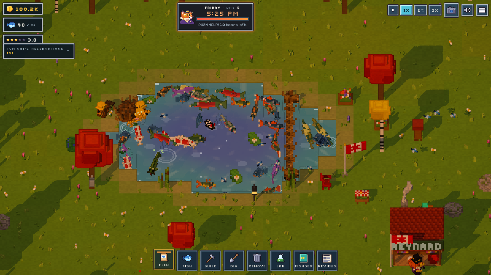

# The Bear Must Eat



A cozy-but-cheeky incremental sandbox game that mixes 3D and 2D pixel art. You are **Reynard**, a greedy fox with a top hat and monocle who runs an all-you-can-eat fish pond in the Canadian wilderness.

Every weekday at **5 PM** the steam whistle blows at *Bear St. Holdings*, the office tower on the mountain. Waves of bears in suits, neckties and hard hats (plus janitors, interns, a lumberjack and the polar-bear CEO) run down the switchback trail, cannonball into your pond and eat your fish. Happy bears throw coins out of their briefcases and leave 5-star reviews. Hungry bears rampage, smash your stuff and post 0-star reviews. If your rating drops below 1.0, the pond gets shut down.

## How to play

- **Feed:** tap the water to toss fish food. Well-fed adult fish fall in love, lay eggs, and the fry grow up.
- **Breed and discover:** buy new species from the Lab. Cross-breeding different species can produce hybrids, such as the Tiger Trout, Aurora Salmon and Sparctic Char. The legendary one is the Maple Leaf Koi. Rarely, a *golden* fish hatches, worth 5x.
- **Plan for tonight:** the *Tonight's reservations* card shows who is coming. Some bears also want:
  - seaweed salad: plant seaweed
  - honey: a weeping willow with a beehive next to it
  - maple syrup: a sugar maple
  - blueberries: blueberry bushes
  - a specific fish
- **Protect your breeding stock:** bears eat every fish they can reach. Hire beavers to build:
  - **dams**, **log fences** and **sluice gates** that wall off a nursery
  - **stilt platforms** for rampage-proof farming (fish hide underneath)
  - **auto-feeders** and **bubble aerators**
- **Grow:** dig the pond bigger, research upgrades (breeding, prices, patience, bigger waves), and survive the Friday CEO visit.
- **Prestige:** reach *Franchise Empire* and retire. Each run earns golden fox tails, and each tail permanently adds 10% to every bill.

### Controls

| Action | Mouse / keyboard | Touch |
| --- | --- | --- |
| Pan | drag, or WASD / arrow keys | one-finger drag |
| Zoom | mouse wheel, `+` / `-` | pinch |
| Rotate | `Q` / `E` | (desktop only) |
| Use the current tool | click | tap |
| Tools | `1`-`8` | toolbar |
| Pause | `Space` | pause button |
| Open early (ring the bell) | `B` | clock button |
| Follow bears | `F` | camera button |
| Cancel | `Esc` | Done button |

## Development

```bash
npm install
npm run dev           # Vite dev server at http://localhost:5173
npm run build         # production build in dist/
npm run build:single  # one self-contained HTML file in dist-single/
```

Plain JavaScript (ES modules), [three.js](https://threejs.org) and Vite. No image or audio assets: every model is a procedural voxel model, the UI sprites are pixel data in `src/ui/sprites.js`, and the sound effects and music are synthesized with the Web Audio API in `src/audio/audio.js`.

```
src/core      pixel renderer (low-res target + outline pass), camera, voxel mesher
src/world     tile grid, world generation, terrain/water shaders, sky, buildings
src/entities  voxel models: fish, bears, fox, beavers, structures
src/game      simulation: fish, food/bugs, bears, beavers, structures, particles, input
src/data      species, bear types, structures, research tree
src/ui        HUD, panels, modals, 3D-rendered icons, pixel sprites
tools/        Playwright screenshot / play-test helpers used during development
```

Useful URL flags while developing: `?autostart=new` skips the title screen, `?notut=1` skips the tutorial, and `window.__step(seconds)` fast-forwards the simulation from the console.
