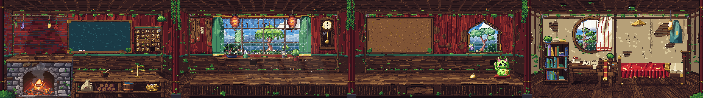
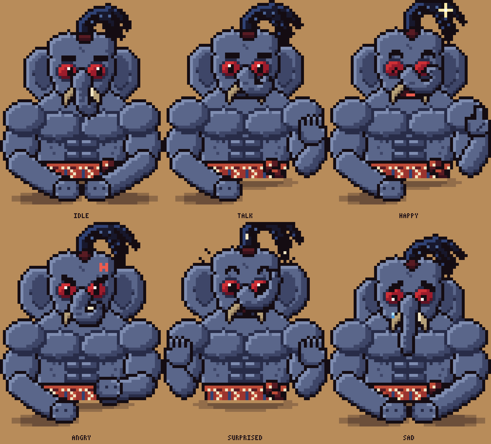
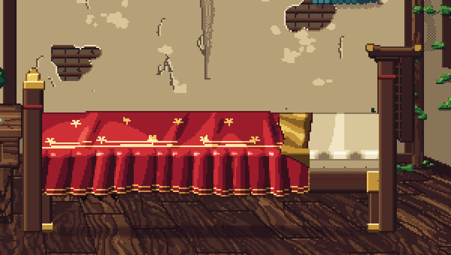
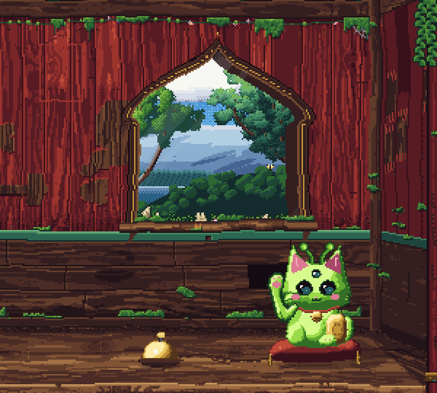
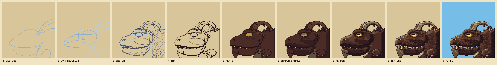

# Old Rundown Teahouse: pixel art asset pack (v3.3)

A first-person view of four rooms in an old, run-down teahouse. It comes with more than 120 separate drag-and-drop props, and Uncle Pong (an optional NPC). Each room is a box in perspective: you see the timber roof with its rafters running away from you, both side walls, the back wall and a plank floor. The palette follows the Spirited Away bathhouse: faded vermilion lacquer, jade trim, tarnished gold, indigo cloth and cream paper. Every word in the teahouse is written in its own rune script, like the enchanting-table language. Moss has crept over everything damp.



**Native resolution:** 640×360 per room, 2560×360 for the whole panorama. That is one screen per room, and 3× gives exactly 1920×1080. Scale by whole numbers with nearest-neighbour filtering.

| Room | x range | What's there |
| --- | --- | --- |
| 1 Cook room | 0 to 640 | A big **stone furnace**, built rock by rock, with a thick wooden top and a wedge-stone arch with a carved keystone. Inside are burning coal, glowing embers, sparks, smoke, and the **talking fire spirit** (all mouth and teeth). Herbs dry on an old bamboo pole above it. Also a big **chalkboard**, wiped clean, an apothecary chest with labelled jars on top, and a prep table. On the table: a hinoki cutting board with a nakiri knife and fresh leaves, a suribachi mortar, and a woven basket. Under it: a burlap sack with a rune stencil, end-grain firewood, a copper-hooped bucket, a basket of dried flowers, and an ash-glazed tsubo jar with a cloth lid |
| 2 Seating | 640 to 1280 | Big lattice **window** onto distant green trees, jade drapes, paper lanterns, plants on the sill, menu tags, pendulum clock. A plain hinoki counter with a cup of tea and one yunomi |
| 3 Tea ritual | 1280 to 1920 | An empty **corkboard**. Where the shelf was there is now a **bell-shaped katōmado window**. On the counter: a new tea set straight on the hinoki (a squat kyusu with a side handle, a black raku chawan of matcha, a chasen whisk, a lacquered natsume with gold pines, a chashaku scoop), a tray of four yunomi, the **green alien lucky cat**, and a **brass call bell**. Ring it and an old **goat-dragon** rises behind the window and rests its chin on the sill. In the counter front is one drawer, the **journal drawer** |
| 4 Traveler's bedroom | 1920 to 2560 | The most run-down room. Plaster has fallen off the walls to show the bamboo lath, rain has streaked them, there is mould in the corners, boards are missing from the roof so daylight shows, and the floor is broken and bare. Indigo noren hanging in front, moon window with a billowing curtain, a **silk bed**, desk, chair with a draped scarf, bookcase, straw hat and cloak on the wall, oil lamp |

## Uncle Pong (optional, not placed)

Uncle Pong is no longer in the scene by default. He is still exported (`props/room2/uncle_pong_*`) if you want to drag him back in.



Uncle Pong is a big, bare-chested uncle, an elephant crossed with the Siamese fireback (Thailand's national bird). He has broad shoulders, a heavy chest, a six-pack and big arms. From the bird he takes his slate-blue fur, the scarlet skin round his eyes, a **collar of feathers** (golden "fire" feathers flaring behind a glossy blue-black ruff and grey hackles), and its crest, worn as a topknot ponytail. He wears nothing but a red checked **pha khao ma** (ผ้าขาวม้า) tied round his waist.

**Style:** chunky. He is drawn on a 56×72 grid and scaled up 3× with nearest neighbour, so his pixels are big like a classic pixel NPC's:

- flat colours with three tones per material
- one black outline round the silhouette, with darker fur lines between the muscles
- bead eyes with a shine, and thick brows that carry most of each expression
- a soft shadow where his forearms rest on the counter

| Mood | What happens (12 frames, 8 fps) |
| --- | --- |
| `idle` | Chest rises as he breathes, trunk swings, topknot sways, he glances aside and blinks. Forearms rest on the counter with his fists together |
| `talk` | Trunk lifts so you see his mouth shapes, brows jump on the loud words, one big hand gestures |
| `happy` | Eyes squeeze to ^^, he laughs with a grin, trunk curls up, he bounces and gives a thumbs up, sparkles |
| `angry` | Brows crash into a V, teeth grit, ears flare, an anger mark pulses, and he slams his fist on the counter with impact lines |
| `surprised` | Eyes go wide, brows shoot up, mouth makes an O, trunk goes up, both palms come up |
| `sad` | Worried brows, eyes looking down, droopy trunk and ears, a tear |
| `sip` | Lifts a small cup of matcha under his curled trunk, eyes closed, then a pleased look |
| `flex` | Double-biceps pose: arms up, biceps pump, eyes squeeze, sparkles |

**Placing NPCs:** the sprite is 168×216. His body stops at the counter's back edge; only his forearms, hands and their shadows reach onto the counter top. So draw NPCs **after** `20_counter`, with the sprite's top at `y = 83`. Slide them along x to seat them anywhere on the counter. Uncle Pong's default seat is x = 876.

## The silk bed



A low lacquered bed with brass fittings and a torii-style headboard (the top rail turns up at the ends). A crimson **silk quilt** embroidered with gold plum blossoms spills over the front in soft folds, with a gold border and piped hem. Its head end is turned down to show the gold silk lining and a cream silk sheet.

The silk is modelled, not hand-dotted. The top is a height field and the front is a row of hanging folds, with rounded crests and sharp creases between them. Both are lit with a diffuse term plus a tight specular term, then snapped to the palette. That gives deep shadow in the creases, a broad bright band where a fold turns to the light, and a near-white streak on the crest.

## The bell and the goat-dragon



The **goat-dragon** (a hybrid of a goat and a dragon) is drawn by hand at full scene resolution (one sprite pixel is one scene pixel). It's old, calm and realistic, not a cartoon: shaggy brown fur, ridged goat horns, a floppy ear, a goatee and a goat's amber eyes with wide bar pupils, on a dragon's long skull with an overbite of teeth and a clawed wing-wrist. It it rests its chin on the sill, and only its eye, breath and jaw move.



**The drawing process** (`wyvern.py` keeps every stage). `preview/wyvern_process.gif` is a timelapse of it being drawn, stroke by stroke:

1. **Gesture:** a few loose sweeps for the action of the head, the neck and the horns.
2. **Construction:** a circle for the cranium, a box for the snout, the eye line and the head axis, drawn over the gesture.
3. **Sketch:** pencil over the turned-down construction. Short, overlapping strokes bow a little off the line and overshoot their ends, and the main contours are gone over twice. Shadows are hatched with short diagonal strokes.
4. **Ink:** clean lines over the faded sketch, one pixel on the lit side and two on the shadow side.
5. **Flats:** local colour, part by part.
6. **Shadow shapes:** the shadows blocked in with one darker tone, before any rendering.
7. **Render:** planes with rounded edges, cast shadows under the brow, jaw, head and horns, and reflected light on the lip.
8. **Texture:** fur, stroke by stroke, following the lie of the hair: back along the head from the nose, down the neck and jaw, long strands in the beard, a shaggy fringe down the back of the neck. Growth rings across the horns.
9. **Final:** the lines folded into the colours, contact shadows, worn highlights, the wet glint in the eye and the sky rim.

**The anatomy** is drawn from hand-placed points (smooth spline curves):

- a long, heavy skull with a domed cranium and a brow over a wide-open goat eye: an amber iris with a wide horizontal bar pupil
- a floppy goat ear behind the eye and a goatee under the chin
- nostrils on top of the snout
- a crocodile overbite: irregular upper teeth hang over the recessed lower jaw, and two lower teeth interlock at the front
- a jaw-muscle bulge and a thick, shaggy neck
- ridged goat horns that sweep back and curl down over the neck
- a clawed wing-wrist gripping the sill

It lives on its own layer, **`outside`**. Draw it after the window view and before the room shell, so the window frame hides the rest of its body.

`dragon_bell` carries an **`on_click`** list in `scene.json`. Each entry names a prop, a one-shot anim to `play`, the anim to go back to (`then`), and an optional fps. Clicking the bell plays `ring` on the bell (then `idle`) and `peek` on `dragon_peek` (then `hidden`). If you want the wyvern to stay at the window, switch it to its `rest` loop after the peek instead. The demo has a *ring the bell* button too.

## Moss

`moss.py` grows moss wherever it is damp:

- cushions on the skirting, the rail and the window sills
- curtains hanging off the girders and round the bedroom roof gaps
- carpets creeping across the floor along the walls
- patches in the back corners, on the side walls and up the posts
- moss on the cool stones of the furnace (never by the fire) and along the bottom of the counter
- a few tufts on old props (the jar, bucket, firewood, bookcase and boards)

Each clump is shaded like a little cushion: a lit rim at the top left, a bumpy body, a dark rim at the bottom right and a contact shadow. Some put up spore stalks with copper capsules. It is all in the room layers, so nothing extra needs placing.

## What moves

Everything loops seamlessly. Animated props have `_sheet.png` files (frames side by side); full-width layers stack their frames vertically.

| Thing | Frames | How |
| --- | --- | --- |
| Uncle Pong: 8 moods | 12 each | See above |
| Furnace fire | 12 | Firebrick lit by the coals; each coal's embers breathe on their own beat; small flames lick up at the sides; sparks rise. Smoke curls up, spills out of the arch and pools under the wooden top. The smoke is the only part with partial alpha, in four steps |
| Fire spirit: `idle`, `talk`, `happy` | 12 each | Sits down in the coals. Flame body is a noise field rising through a teardrop. A jagged maw of uneven teeth opens and closes as it talks; zigzag grin when shut; fangs when it laughs |
| Cloth: noren, curtains, moon curtain, cloak, scarf, towel | 12 | **Real cloth physics**: Verlet particles with stretch/shear/bend constraints, pins, gravity, a looping breeze, and collisions. One wind period is captured so the loop closes |
| Silk bed | 12 | The quilt's hanging folds sway, so the sheen slides across the silk |
| Bell and goat-dragon | 10 + 43 (+ a 25-frame `rest` loop) | Click the bell: it rings. The wyvern slowly rises behind the window with its eyes shut and settles its chin on the sill (dust falls). Its eye opens as the third eyelid slides back, and it looks at the bell and breathes out a long cloud of breath. Then it blinks slowly, parts its jaws with a sigh, glances at you and sinks back down. Both are one-shot animations (see below) |
| Alien lucky cat | 8 | Eased beckoning paw, pulsing antenna lights, a blink, a glint that travels across the coin |
| Garden trees, flower bed, ivy | 8 | Each leaf mass sways on its own phase |
| Lanterns, oil lamp, herb bundles, wind chime | 8 | Swing. The chochin lanterns glow from inside, flicker softly and swing their tassels |
| Candles, steam | 8 | Flicker and curl |
| Light overlay | 8 | The furnace glow flickers, dust drifts in the window shafts, and every window pane has a blocky glass look: a pale edge round each 16 px tile and two little diagonal glints in it |

## How it's drawn

- **Rooms in perspective:** each room is a box with its vanishing point at the centre of the room, on the eye line at y=150.
  - The back wall is inset (x 48 to 592 in each room) and topped by a girder.
  - Rafters run from the girder towards you and converge.
  - The side walls carry the planks, the jade rail and the wainscot round in perspective.
  - Floorboards run towards the vanishing point.
  - The windows are cut through a thick wall, so you see their inner faces.
  - Dark posts in the foreground hide the joins between rooms.
- **Furniture in perspective:** you look down onto the furnace, table and counter. Their far edges recede, and you see the side that faces the middle of the room.
- **Old and run-down:** flat, simple tones, but everything has decades of neglect:
  - The lacquered walls are peeling back to grey bare wood, streaked by rain, grimy above the rail and rotting at the skirting.
  - Boards are broken or missing, some old holes are boarded over, and the nails bleed rust.
  - Wooden and metal props get a weathering pass (`weather.py`): grime in the creases, paint worn through on the edges, tarnished brass, scratches and water stains.
- **No ruler-straight shapes (`organic.py`):** the room layers and every prop go through an organic pass. A smooth noise field bends long straight edges by a pixel or so, the way old timber sags and a hand wobbles. Hard silhouette corners are worn off. Every frame of an animated prop bends the same way, so nothing shimmers. The characters and the fire are left as drawn.
- **The lucky cat** is drawn from hand-placed curves:
  - a pear-shaped sitting body with haunches and a curling tail
  - a soft head with cheek fluff, and curved ears with fur tufts
  - almond eyes, curved antennae with glazed bulbs; the beckoning arm casts a shadow on the head, and the whole cat (arm included) casts a shadow on the counter that moves with the paw, a bent beckoning arm (elbow at its side, paw held up beside the head)
  - a squashy cushion with tassels
- **Real wood grain (`woodgrain.py`):**
  - Each board is modelled as a cut through a log: the growth rings sliced by the board's surface.
  - That gives flat-sawn cathedral arches where the cut runs close to the pith, and straight lines further out.
  - Knots have the rings swirling round them, with dark latewood lines, sheen and dark streaks, and pores.
  - Every board gets its own pith, depth and tone, so neighbours differ.
  - It runs over everything wooden:
    - the lacquered plank walls (the grain shows faintly through the red, and strongly where the lacquer has peeled)
    - the wainscot, skirting, girders, corner posts and sills
    - the floor and ceiling boards in perspective
    - the counter top (fine, straight grain, stained dark), the counter slats, the prep table and the furnace's wooden top
    - every piece of wooden furniture
  - The counter is dark old wood, split along the grain, ringed with tea stains, chipped on the edge, and missing slats.
  - A clean-up pass removes stray single pixels.
- **A Japanese counter:** a dark wooden top over a dark lattice of vertical slats (*tategoshi*), with only a few things on it.
- **3D shading from silhouettes:** ceramics, iron, brass and the cat are lit from a height field. Glossy surfaces get a specular glint.
- **Teaware:** cool blue-grey shadows on white glaze, reflected light on the shadow side, a crisp rim, and a glossy tea surface.
- **Nothing floats:** props that stand on something carry a soft contact shadow. Wall and hanging pieces carry a drop shadow on the wall behind them. These shadows are semi-transparent, so they work wherever a prop is dropped.
- **A fantasy script:** every word in the teahouse is written in its own runes, angular glyphs like the enchanting-table alphabet. That covers the recipe steps, recipe cards, jar labels, menu tags, receipts, the unpaid tab and the fire charm. The strings in the code are plain English (SENCHA 80C 2 MIN), so you can read what each sign says. `RUNES` in `pixel.py` holds the alphabet; `text(..., script='latin')` writes readable letters.

## Folder map

```
layers/outside/   window view: 6 parallax layers (1280 px wide, tile horizontally): a dithered sky with
                  cirrus and cumulus, snow-capped far peaks, hazy ranges, a forested ridge over a
                  still lake, then a canopy of tree crowns and the garden
layers/room/      10 shell (window panes transparent) / 11 shell with wall props baked in
                  20 furnace + prep table + counter / 30 foreground posts + ivy / 40 light overlay
props/roomN/      every prop at 1x (+ _sheet.png; Uncle Pong and the fire spirit have one sheet per mood)
props_3x/roomN/   the same at 3x (1080p size)
atlas/            all prop frames packed into one PNG + JSON (anims, fps, layer, default spot)
nature/           stand-alone green trees, flowers, grass, pampas, falling-leaf particles
palette/          the palette (.gpl for Aseprite/GIMP, .hex, swatch PNG)
scene.json        draw order, parallax, vanishing points, surfaces, every prop with its default x/y
demo/index.html   open in a browser: drag props, pan the rooms, cycle the fire's moods, ring the bell
preview/          full panorama, each room at 1080p, animated GIFs, a parallax pan (.webp)
generator/        the Python that draws all of it (deterministic, seeded)
```

## Putting it in a game

Draw these back to front:

1. `layers/outside/00_sky` to `05_flowers_close`, each at `screen_x = -camera_x * parallax` and repeated every 1280 px. They only show through the window panes.
2. props with `layer: outside` (the goat-dragon behind the bell window)
3. `layers/room/10_room_shell.png`
4. props with `layer: wall`, then `layer: ceiling`
5. `layers/room/20_counter.png`
6. props with `layer: npc` (**your customers**, e.g. Uncle Pong)
7. props with `layer: floor`, then `layer: counter`, then `layer: front`
8. `layers/room/30_foreground` (the posts between rooms, parallax 1)
9. `layers/room/40_light_overlay` (normal or screen blend)

Props with an `on_click` list in `scene.json` are interactive: on a click, play each listed one-shot anim once, then switch that prop to its `then` anim.

Default positions are in `scene.json` (`x`, `y` = top-left in scene pixels). Drop surfaces (y where an object's bottom sits) are under `surfaces`: prep table 284, counter 292, window sill 212, top of the apothecary chest 96, room-3 shelf 184, floor 265. The furnace's wooden top runs from y 198 (back) to 222 (front).

Some props are exported but not placed by default, which keeps the counter and shelves clean. You can drag any of them in:

- **Tea room:** the old glazed cabinet, the teaware shelf and the corkboard notes (receipts, an unpaid tab, a map scrap).
- **Uncle Pong** (the elephant NPC, all his moods) and the white teapot in the seating room.
- **All the tea:** the tea set (kyusu, chawan, chasen, natsume, chashaku), the yunomi tray and cups, the cup of tea and its steam, the tea jars on the apothecary chest, and the tea leaves on the cutting board and in the basket.
- **Bedroom:** the indigo noren hanging at the top left.
- **Tea room:** the hanging scroll with CHAI TEA brushed down it.
- **Cook room:** the recipe cards and the tsubo jar. The chalkboard itself is wiped clean.
- **Cloth:** the indigo tenugui towel (prep table) and the seigaiha tea runner (tea counter), and the glass wind chime.
- **Counter extras:** menu tent card, bud vase, dango plate, sugar pot, green-tea cup, service bell, incense burner, candle.
- **Cook room:** the copper smoke hood, the kama pot, the iron kettle and their steam (for the furnace top, later). Also the long wall shelf, spare jars and tins, small sacks, scroll bundle, spare mortar, open jar, tea brick, torn sack and crate of jars.
- **Bedroom:** the rug, pack, boots, book pile, scattered papers, walking staff and potted plant, plus the route map and the sketch (posters). The floor and walls are bare by default.
- **Single cups:** `yunomi_*`, to drag off the tray.
- **Journal drawer:** `drawer_open` is the swap-in for the closed journal drawer (the demo's *open drawer* button). `journal_closed` and `journal_open` are the item and UI versions of the journal.

## Previews

- `preview/room_1_3x.png` to `room_4_3x.png`: each room at 1920×1080
- `preview/room1_cook_anim.gif` to `room4_bedroom_anim.gif`: every room animated (2 s loops)
- `preview/uncle_pong_<mood>.gif` and `uncle_pong_moods.png`: Uncle Pong close up
- `preview/dragon_bell_peek.gif`: the bell and the goat-dragon
- `preview/wyvern_process.png` and `wyvern_process.gif`: how the wyvern is drawn, stage by stage
- `preview/wyvern_peek.gif` and `wyvern_rest.gif`: the wyvern on its own in its window (the peek, and a resting loop of it breathing and blinking)
- `preview/silk_bed.png`: the silk bed close up
- `preview/fire_spirit_idle.gif`, `fire_spirit_talk.gif`, `fire_spirit_happy.gif`, `alien_lucky_cat.gif`: close-ups
- `preview/pan_parallax.webp`: a camera pan across the four rooms
- `preview/props_contact_sheet.png`: every prop, labelled

## Regenerating / tweaking

```bash
python3 teahouse-assets/generator/build.py          # a few minutes, needs Pillow + numpy
python3 teahouse-assets/generator/build.py --quick  # skip the animated previews
python3 teahouse-assets/generator/package.py out.zip  # the tidy game-ready zip (Old_Rundown_Teahouse/)
```

| What | Where |
| --- | --- |
| Layout, perspective | `generator/layout.py` |
| Rooms | `room.py` (perspective boxes, walls, windows, posts, wear), `counter.py` (stone furnace, table, counter), `furnace.py` (fire, coals, smoke), `weather.py` (aging for props), `moss.py` (moss), `woodgrain.py` (wood grain) |
| Props | `props_cook.py`, `props_seating.py`, `props_ritual.py`, `props_bedroom.py`; `crafted.py` (cook-room baskets, sacks, firewood, bucket, jar), `tea_set.py` (the tea-room set), `silk_bed.py` |
| NPCs | `npc.py` (chunky 3× rig, pixel templates for eyes, brows, mouths and hands, poses per mood), `dragon.py` (the bell), `wyvern.py` (the hand-drawn goat-dragon and its drawing process) |
| Cloth | `cloth.py` (simulation), `cloth_props.py` |
| Teaware | `teaware.py` |
| Fire spirit | `fire.py` |
| Trees and garden | `trees.py`, `leaves.py`, `outside.py` |
| Colours | `RAMPS` in `pixel.py` |

You can also drag props around in `demo/index.html` and press **copy layout JSON** to get their new positions.
