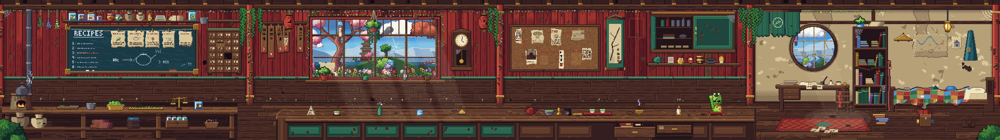

# Old Rundown Teahouse: pixel art asset pack

A seamless first-person panorama of four rooms in an old, run-down teahouse, plus 101 separate drag-and-drop props. The colours follow the Spirited Away bathhouse: faded vermilion lacquer, jade trim, tarnished gold, cream paper, and a bright garden and sky outside.



| Room | x range | What's there |
| --- | --- | --- |
| 1 Prep & boiling | 0 to 480 | Giant chalk **recipe board** (centre) with pegged recipe cards, long storage shelf, apothecary chest, clay stove + iron kettle, prep table with herbs, scale and baskets, plus sacks, firewood and crates underneath |
| 2 Seating | 480 to 960 | Big lattice **window** with the layered garden view, menu tags, clock stopped at 4:20, red lanterns, wind chime, plants on the sill, curved counter start with the gap for the keeper |
| 3 Tea ritual | 960 to 1440 | **Corkboard** of worn notes and red string, hanging scroll, jade storage cabinet, teaware shelf, counter with drawers (**journal drawer**), tea set, incense, candle, the **green alien lucky cat** |
| 4 Traveler's bedroom | 1440 to 1920 | Torn noren doorway, moon window, messy bed with a patchwork quilt, leaning bookshelf, messy desk, chair, hat, cloak, staff, backpack, rug, map |

Everything is **native resolution 1920×270** (each room is 480×270, i.e. one screen at 4× = 1920×1080). Scale by integers with nearest-neighbour filtering.

## Animated previews

* `preview/room2_window_anim.gif`: room 2 with the trees, flowers, ivy, steam and chime moving
* `preview/room4_bedroom_anim.gif`: the bedroom
* `preview/pan_parallax.webp`: a camera pan across all four rooms showing the window parallax
* `preview/room_N_4x.png`: each room at 1920×1080
* `preview/props_contact_sheet.png`: every prop, labelled
* `preview/trees_sheet.png`: the stand-alone animated trees

## Folder map

```
layers/outside/    window view: 6 parallax layers, 960 px wide, tile horizontally
layers/room/       10 shell (window panes transparent) / 11 shell with wall props baked in
                   20 counter + prep table / 30 foreground ivy+plants / 40 light overlay
props/roomN/       every prop as its own PNG at 1x (+ _sheet.png for animated ones)
props_4x/roomN/    the same at 4x
atlas/             all prop frames packed into one PNG + JSON (frames, fps, layer, scene spot)
nature/            stand-alone animated trees, flowers, grass tufts, pampas, falling leaves
palette/           89-colour palette (.gpl for Aseprite/GIMP, .hex, swatch PNG)
scene.json         layer order, parallax factors, surfaces, every prop with its default x/y
demo/index.html    open in a browser: drag props around, pan between rooms
generator/         the Python that draws all of it (deterministic, seeded)
```

## Putting it in a game

Draw these back to front:

1. `layers/outside/00_sky` to `05_flowers_close`, each at `screen_x = -camera_x * parallax` and repeated every 960 px. They only show through the transparent window panes.
2. `layers/room/10_room_shell.png`
3. props with `layer: wall`, then `layer: ceiling` (lanterns, herbs, noren)
4. **your customers** (they sit between the wall and the counter)
5. `layers/room/20_counter.png`
6. props with `layer: floor` (bedroom furniture, things under the prep table), then `layer: counter` (things standing on the counter/table), then `layer: front`
7. `layers/room/30_foreground` (parallax ≈ 1.12)
8. `layers/room/40_light_overlay.png`, the only layer with partial alpha (normal or screen blend)

Default prop positions are in `scene.json` (`x`, `y` = top-left in scene pixels). Handy drop surfaces (y where an object's bottom should sit) are listed under `surfaces`: prep table 211, counter 222, window sill 154, room-1 shelf 40, room-3 shelf 122, floor 199.

`drawer_open` is meant to be swapped in over the closed drawer in the counter when the player opens it. `journal_closed` and `journal_open` are exported but not placed by default; they're the item and UI versions of the journal.

### Animation

All moving parts loop seamlessly. Sheets have frames side by side, except the full-width layers, which stack frames vertically.

| Sprite | Frames | fps |
| --- | --- | --- |
| `04_trees_garden`, `05_flowers_close` (layers) | 8 | 6 |
| `30_foreground` (ivy sway) | 8 | 6 |
| trees in `nature/trees/` | 8 | 6 |
| flowers, grass tufts, pampas in `nature/` | 8 | 6 |
| `alien_lucky_cat` (paw beckons, antennae blink) | 4 | 4 |
| `stove_clay` fire, `candle` flame | 4 | 8 |
| `steam_puff`, `incense_burner`, `wind_chime`, `noren_curtain` | 4 | 4 to 6 |
| `particle_petal`, `particle_leaf_green`, `particle_leaf_maple` | 4 | 8 |

The trees are built like hand-pixelled trees: twisting reddish trunks with bark strands and flared roots, and foliage made of hundreds of individual pointed leaves (or blossoms, maple stars, pine-needle fans), lit leaves laid over shaded ones, with one dark outline. Each leaf mass sways on its own phase.

## Regenerating / tweaking

```bash
python3 teahouse-assets/generator/build.py          # ~40 s, needs Pillow + numpy
python3 teahouse-assets/generator/build.py --quick  # skip the GIF/WebP previews
```

* Positions: edit the `@prop(...)` decorators in `generator/props_room12.py` and `generator/props_room34.py`. Or drag things in `demo/index.html` and press **copy layout JSON**.
* Colours: `RAMPS` in `generator/pixel.py`. Every pixel comes from those ramps.
* Trees: `generator/trees.py` (species) and `generator/leaves.py` (leaf rendering). Garden layout: `trees()` in `generator/outside.py`.
* Rooms: `generator/room.py` (walls, windows, floor), `generator/counter.py` (counter and table).
